
# BETR Implementation for Trajectory Prediction

I have trained this architecture on [**Argoverse2** Dataset](https://www.argoverse.org/av2.html) and tested it using suitable metrics (Mean Displacement Error `MDE`, Final Displacement Error `FDE`, Miss Rate `MR`).

---

# Table of Contents: 
* BETR Custom Implementation.
  * [Description.](#1)
  * [Table of Contents.](#2)
  * [Customization.](#3)
  * [Installation.](#4)
  * [Usage.](#5)
    * [Preprocess Argoverse Data.](#6)
    * [Train Model.](#7)
  * [Train process.](#10)
* Results
  * [Qualitative results.](#8)
  * [Quantitative results.](#9)

# Customization: 

## __First__
I have extracted my vector representation from data such that:

### Agent Vectors: 
$$V_i = [\begin{matrix} x_s & y_s & x_e & y_e & ts_{avg} & Candidate Density & vx_{avg} & vy_{avg} & heading_{avg} & P_{id}\end{matrix}]$$

### Object Vectors: 
$$V_i = [\begin{matrix} x_s & y_s & x_e & y_e & ts_{avg} & D_{a_{avg}} & \theta_{a_{avg}} & vx_{avg} & vy_{avg} & heading_{avg} & objtype & P_{id} \end{matrix}]$$

### Lane Vectors: 
$$V_i = [\begin{matrix} x_s & y_s & z_s & x_e & y_e & z_e & I(Intersection)& dir_{avg} & type & line_{id} \end{matrix}]$$

## **Second**
I have replaced `GNN based Graph Local Encoders` with other vector encoder for each type of vector using `transformers and attention mechanism`, I have also used **Positional Encoding** based on time step of each vector to hold time information.

I also replaced normal `Global GNN layer` with Attentional GNN to better encode vectors of each type.

I Used a simple **Decoder** consists of `three MLP layers` to compare it with other model regardeless of decoder architecture.

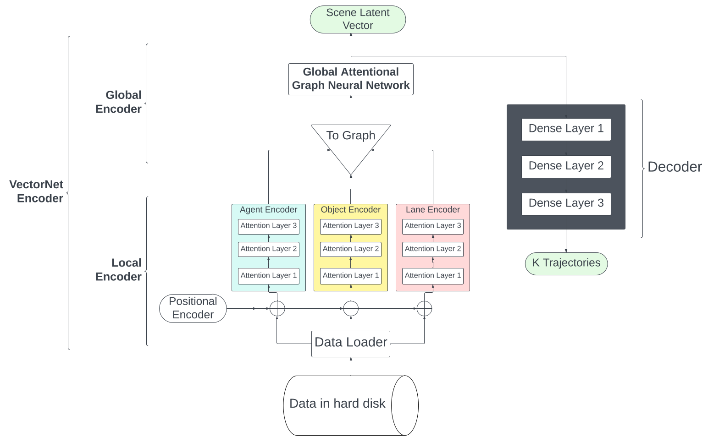

  <em>fig.1 Global Architecture</em>

| 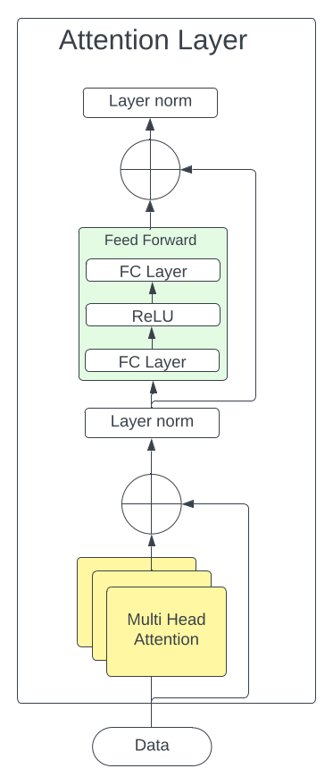| 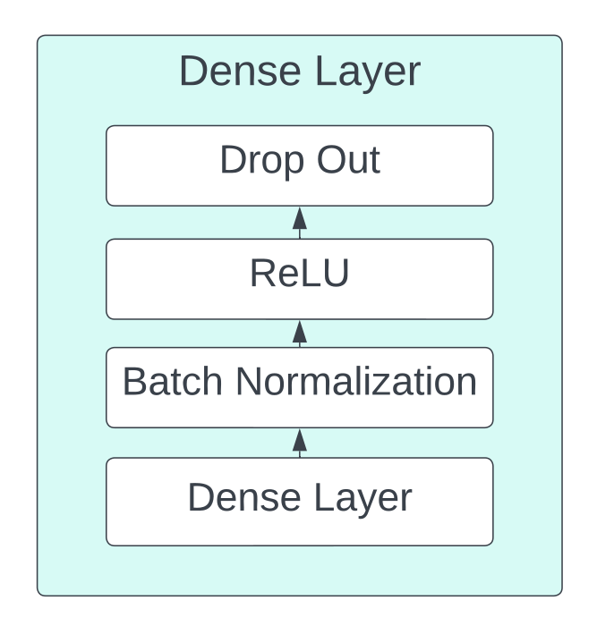 |
| ----------- | ----------- |

  <em>Transformer inside design</em> &nbsp;&nbsp;&nbsp;&nbsp;&nbsp;&nbsp;&nbsp;&nbsp;&nbsp;&nbsp;&nbsp;&nbsp;&nbsp;&nbsp;&nbsp;&nbsp;&nbsp;&nbsp;&nbsp;&nbsp;&nbsp;&nbsp;&nbsp;&nbsp;&nbsp;&nbsp;&nbsp;&nbsp;&nbsp;&nbsp;&nbsp;&nbsp;&nbsp;
  <em>Dense Layer inside design</em> 

----

# Installation:

Required Python Libraries: 
<pre>
    torch-geometric
    kornia
    colorama
    universal-pathlib
    plotly
</pre>

<pre>bash
> pip3 install -r requirements.txt
</pre>

# Usage:

## Preprocess Argoverse Data: 
Build **Docker** image to preprocess data in multithreads

<pre>bash
> docker build -t preprocess .
</pre>

Run script to run processing image: 
<pre>run.sh
  #!/bin/bash
  echo passwd | sudo -S rm /usr/bin/logs
  cd /usr/bin
  echo passwd | sudo -S touch /usr/bin/logs
  echo passwd | sudo -S chmod +777 /usr/bin/logs
  echo "Starting..." | cat >> logs
  while ! ping -c 1 google.com; do
  	sleep 5
  done
  
  echo "Internet Available..." | cat >> logs
  echo passwd | sudo -S systemctl start docker 
  sleep 10s
  echo passwd | sudo -S docker ps -a >> logs

  docker run --rm -it -v "/home/mahmoud":/main --gpus all preprocess
</pre>

<pre>bash
> sh run.sh
</pre>

## Train model: 
Build **Docker** image to train model using processed data.
Edit in `config.py` file to be compatible with your own configurations

<pre>bash
> docker build -t train .
</pre>

Run script to run training image: 
<pre>run.sh
  #!/bin/bash
  echo passwd | sudo -S rm /usr/bin/logs
  cd /usr/bin
  echo passwd | sudo -S touch /usr/bin/logs
  echo passwd | sudo -S chmod +777 /usr/bin/logs
  echo "Starting..." | cat >> logs
  while ! ping -c 1 google.com; do
  	sleep 5
  done
  
  echo "Internet Available..." | cat >> logs
  echo passwd | sudo -S systemctl start docker 
  sleep 10s
  echo passwd | sudo -S docker ps -a >> logs

  docker run --rm -it -v "/home/mahmoud":/main --gpus all train
</pre>

<pre>bash
> sh run.sh
</pre>

---

## Train process: 
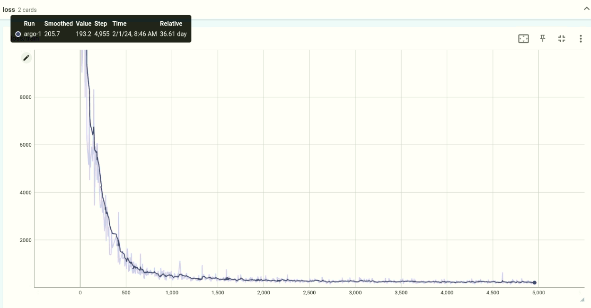

  <em>train loss</em>

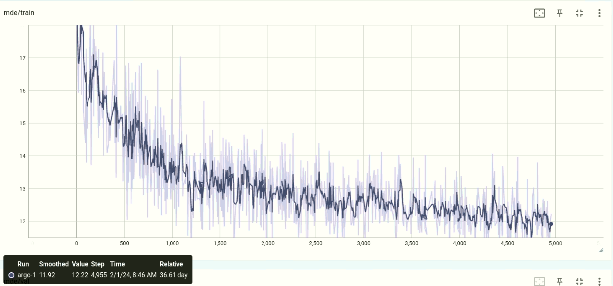 

  <em>train mde</em>

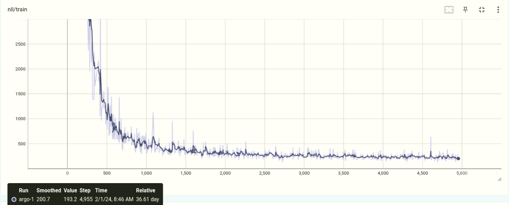 

  <em>train nll</em>

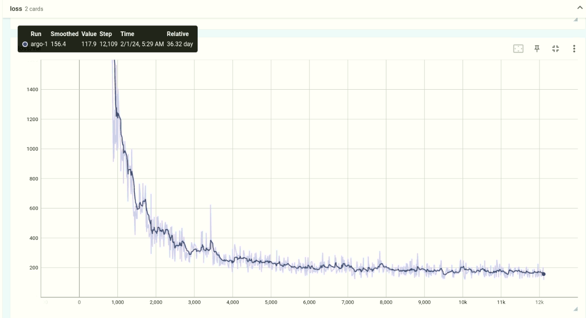 

  <em>val loss</em>

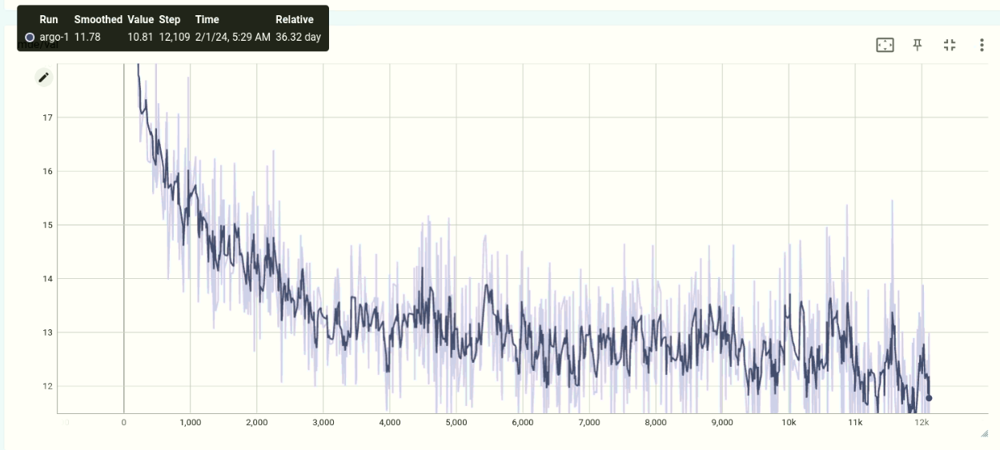 

  <em>val mde</em>

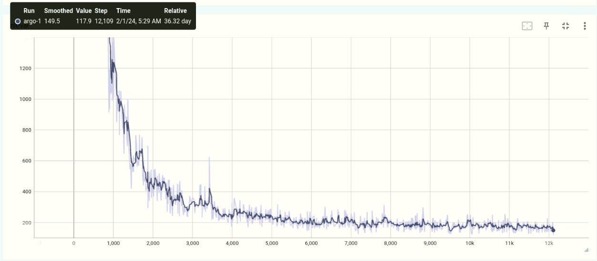

  <em>val nll</em>

---
# Results

## Qualitative results:
|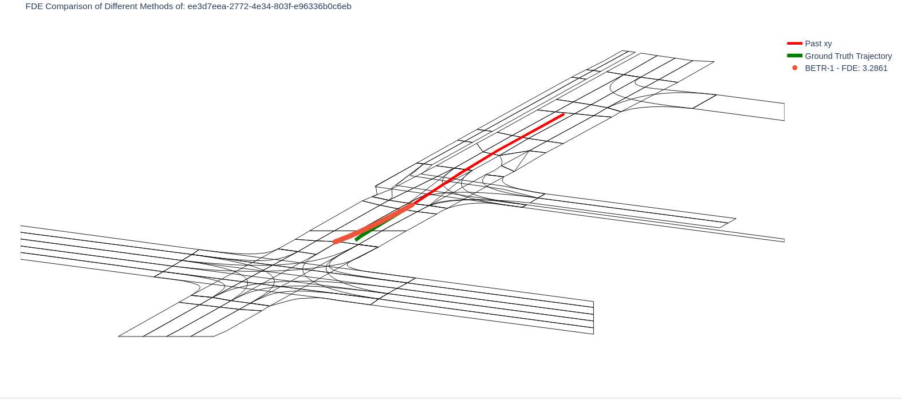|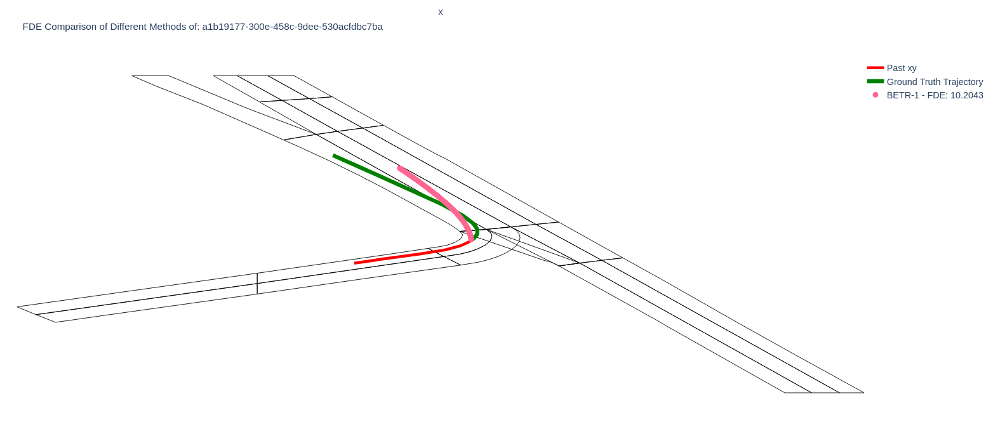|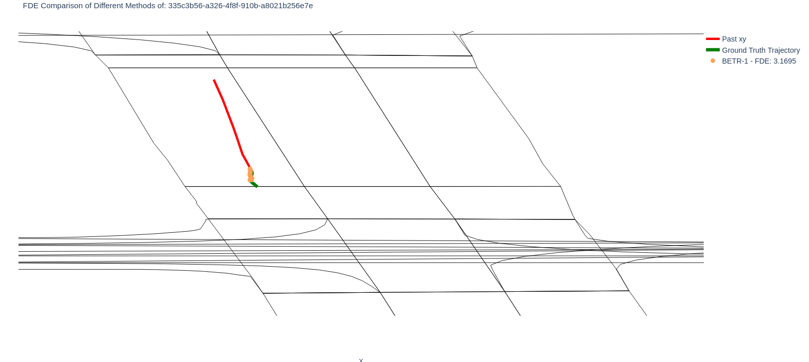|
|-|-|-|

## Quantitative results:

|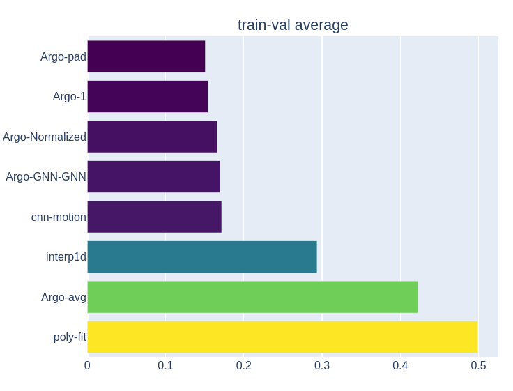|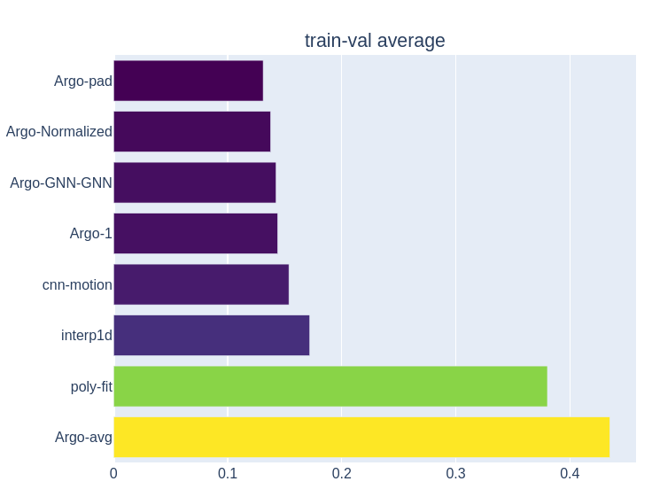
|-|-|

  <em>minimum (Average, Final) Displacement Error Comparison</em>

---

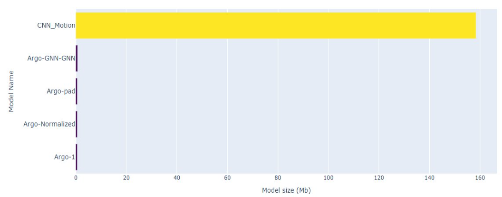

  <em>Model Size comparison</em>

---
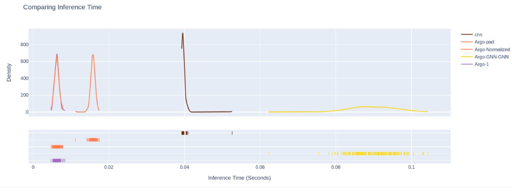

  <em>inference time comparison</em>

